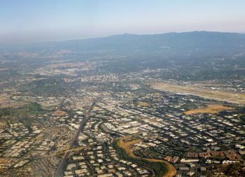
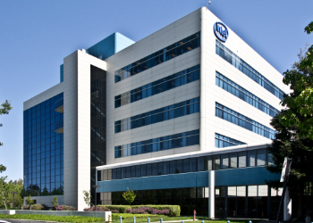

# Silicon Valley
 The high-tech hub of the Bay Area 

## _About Silicon Valley_
 

  Silicon Valley is a region in the southern part of the San Francisco Bay Area in Northern California that serves as a global center for high technology, innovation, and social media. It corresponds roughly to the geographical Santa Clara Valley, although its boundaries have increased in recent decades. San Jose is the Valley's largest city, the third largest in California, and the tenth largest in the United States. Other major Silicon Valley cities include Palo Alto, Menlo Park, Redwood City, Cupertino, Santa Clara, Mountain View, and Sunnyvale. The San Jose Metropolitan Area has the third-highest GDP per capita in the world (after Zurich, Switzerland and Oslo, Norway), according to the Brookings Institution.
  
  The word "silicon" in the name originally referred to the large number of innovators and manufacturers in the region specializing in silicon based MOS transistors and integrated circuit chips. The area is now home to many of the world's largest high-tech corporations, including the headquarters of more than 30 businesses in the Fortune 1000, and thousands of startup companies. Silicon Valley also accounts for one-third of all of the venture capital investment in the United States, which has helped it to become a leading hub and startup ecosystem for high-tech innovation and scientific development. It was in Silicon Valley that the silicon-based integrated circuit, the microprocessor, and the microcomputer, among other technologies, were developed. As of 2013, the region employed about a quarter of a million information technology workers.
  
  As more high-tech companies were established across San Jose and the Santa Clara Valley, and then north towards the Bay Area's two other major cities, San Francisco and Oakland, the term "Silicon Valley" has come to have two definitions: a geographic one, referring to Santa Clara County, and a metonymical one, referring to all high-tech businesses in the Bay Area. The term is often used as a synecdoche for the American high-technology economic sector. The name also became a global synonym for leading high-tech research and enterprises, and thus inspired similar named locations, as well as research parks and technology centers with a comparable structure all around the world. Due to the personal connection between people and technology, many headquarters of companies in Silicon Valley are a hotspot for tourism. 

## _History (Post-1970s)_

 ### **Computer Chips**
  

  Following the 1959 inventions of the monolithic integrated circuit (IC) chip by Robert Noyce at Fairchild, and the MOSFET (MOS transistor) by Mohamed Atalla and Dawon Kahng at Bell Labs, Atalla first proposed the concept of the MOS integrated circuit (MOS IC) chip in 1960, and then the first commercial MOS IC was introduced by General Microelectronics in 1964. The development of the MOS IC led to the invention of the microprocessor, incorporating the functions of a computer's central processing unit (CPU) on a single integrated circuit. The first single-chip microprocessor was the Intel 4004, designed and realized by Federico Faggin along with Ted Hoff, Masatoshi Shima and Stanley Mazor at Intel in 1971. In April 1974, Intel released the Intel 8080, a "computer on a chip", "the first truly usable microprocessor".

 ### **Homebrew Computer Club**
  The Homebrew Computer Club was an informal group of electronic enthusiasts and technically minded hobbyists who gathered to trade parts, circuits, and information pertaining to DIY construction of computing devices. It was started by Gordon French and Fred Moore who met at the Community Computer Center in Menlo Park. They both were interested in maintaining a regular, open forum for people to get together to work on making computers more accessible to everyone.
 
  The first meeting was held as of March 1975 at French's garage in Menlo Park, San Mateo County, California; which was on occasion of the arrival of the MITS Altair microcomputer, the first unit sent to the area for review by People's Computer Company. Steve Wozniak and Steve Jobs credit that first meeting with inspiring them to design the original Apple I and (successor) Apple II computers. As a result, the first preview of the Apple I was given at the Homebrew Computer Club. Subsequent meetings were held at an auditorium at the Stanford Linear Accelerator Center.

 ### **Software**
  Although semiconductors are still a major component of the area's economy, Silicon Valley has been most famous in recent years for innovations in software and Internet services. Silicon Valley has significantly influenced computer operating systems, software, and user interfaces.
 
  Using money from NASA, the US Air Force, and ARPA, Doug Engelbart invented the mouse and hypertext-based collaboration tools in the mid-1960s and 1970s while at Stanford Research Institute (now SRI International), first publicly demonstrated in 1968 in what is now known as The Mother of All Demos. Engelbart's Augmentation Research Center at SRI was also involved in launching the ARPANET (precursor to the Internet) and starting the Network Information Center (now InterNIC). Xerox hired some of Engelbart's best researchers beginning in the early 1970s. In turn, in the 1970s and 1980s, Xerox's Palo Alto Research Center (PARC) played a pivotal role in object-oriented programming, graphical user interfaces (GUIs), Ethernet, PostScript, and laser printers.
 
  While Xerox marketed equipment using its technologies, for the most part its technologies flourished elsewhere. The diaspora of Xerox inventions led directly to 3Com and Adobe Systems, and indirectly to Cisco, Apple Computer, and Microsoft. Apple's Macintosh GUI was largely a result of Steve Jobs' visit to PARC and the subsequent hiring of key personnel. Cisco's impetus stemmed from the need to route a variety of protocols over Stanford University's Ethernet campus network. 

## _Economy_
 The San Francisco Bay Area has the largest concentration of high-tech companies in the United States, at 387,000 high-tech jobs, of which Silicon Valley accounts for 225,300 high-tech jobs. Silicon Valley has the highest concentration of high-tech workers of any metropolitan area, with 285.9 out of every 1,000 private-sector workers. Silicon Valley has the highest average high-tech salary in the United States at $144,800. Largely a result of the high technology sector, the San Jose-Sunnyvale-Santa Clara, CA Metropolitan Statistical Area has the most millionaires and the most billionaires in the United States per capita.
 
 The region is the biggest high-tech manufacturing centre in the United States. The unemployment rate of the region was 9.4% in January 2009 and has decreased to a record low of 2.7% as of August 2019. Silicon Valley received 41% of all U.S. venture investment in 2011, and 46% in 2012. More traditional industries also recognize the potential of high-tech development, and several car manufacturers have opened offices in Silicon Valley to capitalize on its entrepreneurial ecosystem.
 
 Manufacture of transistors is, or was, the core industry in Silicon Valley. The production workforce was for the most part composed of Asian and Latino immigrants who were paid low wages and worked in hazardous conditions due to the chemicals used in the manufacture of integrated circuits. Technical, engineering, design, and administrative staffs were in large part well compensated.
 
 Silicon Valley has a severe housing shortage, caused by the market imbalance between jobs created and housing units built: from 2010 to 2015, many more jobs have been created than housing units built. (400,000 jobs, 60,000 housing units) This shortage has driven home prices extremely high, far out of the range of production workers. As of 2016 a two-bedroom apartment rented for about $2,500 while the median home price was about $1 million. The Financial Post called Silicon Valley the most expensive U.S. housing region. Homelessness is a problem with housing beyond the reach of middle-income residents; there is little shelter space other than in San Jose which, as of 2015, was making an effort to develop shelters by renovating old hotels.
 
 The Economist also attributes the high cost of living to the success of the industries in this region. Although, this rift between high and low salaries is driving many residents out who can no longer afford to live there. In the Bay Area, the number of residents planning to leave within the next several years has had an increase of 12% since 2016, from 34% to 46%. 

## _Media_
 In 1980, Intelligent Machines Journal changed its name to InfoWorld, and, with offices in Palo Alto, began covering the emergence of the microcomputer industry in the valley.
 
 Local and national media cover Silicon Valley and its companies. CNN, The Wall Street Journal, and Bloomberg News operate Silicon Valley bureaus out of Palo Alto. Public broadcaster KQED (TV) and KQED-FM, as well as the Bay Area's local ABC station KGO-TV, operate bureaus in San Jose. KNTV, NBC's local Bay Area affiliate "NBC Bay Area", is located in San Jose. Produced from this location is the nationally distributed TV Show "Tech Now" as well as the CNBC Silicon Valley bureau. San Jose-based media serving Silicon Valley include the San Jose Mercury News daily and the Metro Silicon Valley weekly.
 
 Specialty media include El Observador and the San Jose / Silicon Valley Business Journal. Most of the Bay Area's other major TV stations, newspapers, and media operate in San Francisco or Oakland. Patch.com operates various web portals, providing local news, discussion and events for residents of Silicon Valley. Mountain View has a public nonprofit station, KMVT-15. KMVT-15's shows include Silicon Valley Education News (EdNews)-Edward Tico Producer. 

## _Notiable Companies_
 Thousands of high technology companies are headquartered in Silicon Valley. Listed are some that are in the Fortune 1000: 
 
 - Juniper Networks
 - Apple Inc
 - Tesla Inc
 - Alphabet Inc
 - KLA
 - Intel
 - Twitter

## _Higher Education_
 - Stanford University
 - University of California, Berkeley
 - University of California, San Francisco
 - University of California, Santa Cruz, Silicon Valley Campus
 - San Francisco State University
 - City College of San Francisco
 - San José State University

## _Citations_
 - Silicon Valley Business Journal – San Jose Area has World's Third-Highest GDP Per Capita, Brookings Says [Link to source](http://www.bizjournals.com/sanjose/news/2015/01/23/san-jose-has-worlds-third-highest-gdp-per-capita.html)
 - "Monthly employment continues upward climb". Silicon Valley Index. Archived from the original on September 24, 2013. Retrieved September 24, 2013. [Link to source](http://www.siliconvalleyindex.org/index.php/economy/employment)
 - Sturgeon, Timothy J. (2000). "How Silicon Valley Came to Be". In Kenney, Martin (ed.). Understanding Silicon Valley: The Anatomy of an Entrepreneurial Region. Stanford University. ISBN 978-0-8047-3734-0. [Link to source](https://books.google.com/books?id=CLxzUW4V_2cC&pg=PA15)

## _Sources_
 [Link to Wikipedia](https://en.wikipedia.org/wiki/Silicon_Valley)